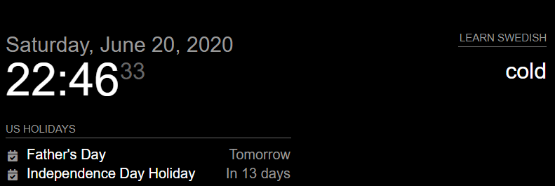
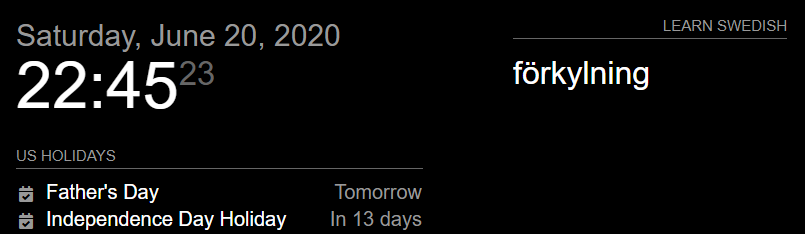

# MMM-learnlanguage

[MagicMirror²](https://magicmirror.builders/) module for learning a word every time you look in the mirror.




## Installation

Navigate into your MagicMirror's modules folder and execute

```sh
git clone https://github.com/thekampany/MMM-learnlanguage
```

## Using the module

This module shows a word of a language you want to learn, alternating with the meaning in English. Train yourself.
You will have to learn the grammar of the language somewhere else. This just helps in getting to know a set of commonly used words.
The set of commonly used words is stored in a CSV file per language.

## Config options

| option                 | description                                                                                                                                                                  |
| ---------------------- | ---------------------------------------------------------------------------------------------------------------------------------------------------------------------------- |
| `language`             | `"danish"`, `"esperanto"`, `"french"`, `"frisian"`, `"german"`, `"italian"`, `"japanese"`, `"spanish"` or `"swedish"`. Has to match the name of the CSV file that contains the wordpairs. |
| `nextWordInterval`     | In milliseconds. The interval between wordpairs.<br>Example: `24*60*60*1000` (eyery 24 hours).<br>Default: `12*60*60*1000` (every 12 hours).                                 |
| `showpair`             | `"showboth"` or `"alternating"`<br>Default: `alternating`                                                                                                                    |
| `toggleInterval`       | In milliseconds. Toggle time between own language word and foreign language word.<br>Only relevant if `"showpair": "alternating"`.<br>Default: `10*1000` (every 10 seconds). |
| `wordpaircssclassname` | Influences the fontsize, uses the CSS from main CSS.                                                                                                                         |
| `showHeader`           | Display header and horizontal rule above wordpairs.<br>Default: `true`                                                                                                       |

## Configuration

Here are two examples for an entry in `config.js`:

### Simple example with wordpairs

**Spanish - new wordpair every 12 hours with hidden header**

```js
  {
    module: "MMM-learnlanguage",
    position: "top_right",
    config: {
      language: "spanish",
      nextWordInterval: 12*60*60*1000,
      showpair: "showboth",
      wordpaircssclassname: "bright medium",
      showHeader: false
    }
  },
```

### Two instances with alternating words

If multiple languages are learned in your household, you can also run multiple instances of the module by adding the module settings multiple times into the `config.js`.

**German and Esperanto - new word every 24 hours - words are shown alternating every 5 seconds**

```js
  {
    module: "MMM-learnlanguage",
    position: "top_right",
    config: {
      language: "german",
      nextWordInterval: 24*60*60*1000,
      showpair: "alternating",
      toggleInterval: 5*1000,
      wordpaircssclassname: "bright large"
    }
  },
  {
    module: "MMM-learnlanguage",
    position: "top_right",
    config: {
      language: "esperanto",
      nextWordInterval: 24*60*1000,
      showpair: "alternating",
      toggleInterval: 5*1000,
      wordpaircssclassname: "bright large"
    }
  },
```

## ToDo

- Use a translation API in order to be able to translate from any to any language.
